# REMAR Acolhimento

[🇺🇸 English](README.md) | [🇧🇷 Português](README.pt-BR.md)

### Plataforma Full-Stack de Gestão de Acolhimento Social | Estudo de Caso de Engenharia de Software

**Organização:** Associação Remar do Brasil (Remar Brasil)  
**Função:** Engenheiro de Software | Único Desenvolvedor Full-Stack  
**Produto:** REMAR Acolhimento  
**Infraestrutura:** DigitalOcean  
**Desenvolvimento:** Evolução contínua do produto

## Visão Geral

O REMAR Acolhimento é uma plataforma de software full-stack desenvolvida para a Associação Remar do Brasil, com o objetivo de apoiar operações de acolhimento social, gestão de unidades de acolhimento e processos institucionais.

A plataforma centraliza informações operacionais, melhora a rastreabilidade e oferece acesso baseado em funções e permissões a registros sensíveis distribuídos entre unidades da organização.

Este repositório apresenta um estudo de caso técnico do trabalho de engenharia realizado na plataforma. O código-fonte da aplicação é proprietário e não está publicado aqui.

## Documentação Técnica

Explore a arquitetura do sistema, as decisões técnicas e a infraestrutura:

- **[Arquitetura do Sistema — Português](docs/pt-BR/arquitetura.md)**
- **[System Architecture — English](docs/en/architecture.md)**

A documentação aborda arquitetura frontend e backend, engenharia de banco de dados, autenticação, autorização, infraestrutura em nuvem, testes e evolução do produto.

## Minha Atuação

Sou o único desenvolvedor humano full-stack responsável pela engenharia de software da plataforma, incluindo:

- Desenvolvimento da API backend e regras de negócio
- Arquitetura frontend e interfaces de usuário
- Modelagem de banco de dados relacional e migrações
- Autenticação e autorização baseada em funções
- Integração dos módulos operacionais
- Testes automatizados e validação técnica
- Implantação em nuvem e configuração de infraestrutura
- Evolução e manutenção contínua do produto

Ferramentas de desenvolvimento assistido por inteligência artificial, incluindo Cursor e ChatGPT, são utilizadas ao longo do processo de engenharia. Permaneço responsável pelas decisões técnicas, revisão das implementações, integração e validação.

## Tecnologias Utilizadas

| Camada | Tecnologias |
|---|---|
| Frontend | Vue 3, Quasar 2, JavaScript, Vite |
| Backend | Node.js, Express 5, APIs REST |
| Banco de Dados | PostgreSQL, Prisma ORM |
| Autenticação | JWT, bcrypt |
| Autorização | Controle de Acesso Baseado em Funções (RBAC) |
| Nuvem | DigitalOcean App Platform, PostgreSQL Gerenciado |
| Armazenamento de Objetos | DigitalOcean Spaces — provisionado |
| Testes | Executor nativo de testes do Node.js |
| Ferramentas de Desenvolvimento | Git, GitHub, Cursor, ChatGPT |

## Arquitetura do Sistema

A aplicação utiliza uma arquitetura cliente-servidor, com backend modular e frontend baseado em Vue.

**Frontend**
- Aplicação de página única (SPA) desenvolvida com Vue 3 e Quasar
- Componentes de interface reutilizáveis e páginas com roteamento
- Comunicação com a API por meio de um utilitário centralizado de requisições
- Navegação e fluxos de trabalho orientados por permissões

**Backend**
- API REST desenvolvida com Node.js e Express
- Organização em rotas, controladores e serviços
- Acesso ao banco de dados por meio do Prisma
- Middleware de autenticação e autorização
- Regras de negócio para operações institucionais

**Banco de Dados**
- Banco de dados relacional PostgreSQL
- Esquema Prisma e migrações
- Relacionamentos estruturados entre entidades operacionais
- Migração de uma implementação anterior baseada em SQLite

**[Visualizar a documentação completa da arquitetura →](docs/pt-BR/arquitetura.md)**

## MVP 1 — Plataforma Principal

A aplicação implementada inclui funcionalidades para:

- Gestão de pessoas acolhidas e seus registros institucionais
- Internações e histórico de acolhimento
- Transferências entre unidades organizacionais
- Documentos e informações de contato
- Gestão de unidades e capacidade de acolhimento
- Registros relacionados à saúde e histórico de alterações
- Eventos e atividades operacionais
- Usuários, funções e permissões
- Indicadores de dashboard e visibilidade operacional

Esses módulos formam a base dos fluxos de gestão institucional da plataforma.

## Infraestrutura em Nuvem

O ambiente de produção está hospedado na DigitalOcean e inclui:

- **App Platform:** Ambiente de implantação da aplicação
- **PostgreSQL Gerenciado 17:** Banco de dados relacional gerenciado
- **Spaces:** Armazenamento de objetos provisionado para a arquitetura de armazenamento da plataforma

A aplicação continua evoluindo por meio de atividades contínuas de desenvolvimento e implantação.

## Segurança e Controle de Acesso

A segurança é uma consideração central de engenharia, pois a plataforma trabalha com informações institucionais sensíveis.

Os controles implementados incluem:

- Autenticação baseada em JWT
- Hash de senhas com bcrypt
- Controle de acesso baseado em funções (RBAC)
- Verificações de permissões nas requisições ao backend
- Restrições de acesso conforme responsabilidades organizacionais
- Acesso autenticado a recursos protegidos da aplicação

Este estudo de caso não divulga registros privados, credenciais ou detalhes confidenciais da implementação.

## Engenharia de Banco de Dados

O projeto evoluiu de SQLite para PostgreSQL para atender ao seu modelo de dados relacional e à arquitetura de implantação em nuvem.

O trabalho de engenharia de banco de dados inclui modelagem de esquemas, relacionamentos entre entidades, migrações e integração com o Prisma ORM.

## Testes Automatizados

O backend possui uma suíte de testes automatizados utilizando os recursos nativos de testes do Node.js.

Os testes concentram-se no comportamento da aplicação, nas regras de negócio e nas funcionalidades do backend. A cobertura e os resultados das execuções são acompanhados como parte do processo de desenvolvimento.

## MVP 2 — Evolução do Produto

A próxima fase do produto amplia a base estabelecida pelo MVP 1.

O planejamento de engenharia inclui novos fluxos operacionais, funcionalidades de relatórios, auditoria, melhorias relacionadas à privacidade e aperfeiçoamento dos módulos existentes.

As funcionalidades desta seção representam o planejamento de evolução do produto, exceto quando documentadas separadamente como implementadas.

## Android e iOS — Planejamento Mobile

A estratégia multiplataforma do produto inclui futuras experiências para Android e iOS.

A stack atual, baseada em Vue e Quasar, oferece uma base para avaliar abordagens de desenvolvimento mobile. O empacotamento de aplicações, as funcionalidades específicas de cada plataforma e a distribuição serão documentados conforme forem implementados.

## Destaques de Engenharia

Este projeto demonstra experiência prática em:

- Responsabilidade integral pelo desenvolvimento de um produto full-stack
- Transformação de processos institucionais em soluções de software
- Modelagem e evolução de bancos de dados relacionais
- Implementação de autorização em diferentes camadas da aplicação
- Gestão de entidades de negócio complexas e interconectadas
- Migração entre tecnologias de banco de dados
- Preparação e operação de infraestrutura em nuvem
- Desenvolvimento de testes automatizados de backend
- Utilização de ferramentas assistidas por IA em um processo de engenharia conduzido por um desenvolvedor humano

## Estudo de Caso e Documentação

Este repositório apresenta documentação técnica sobre a arquitetura, infraestrutura, segurança, engenharia de banco de dados e evolução de uma plataforma de software real.

**Documentação disponível:**

- [Arquitetura do Sistema (Português)](docs/pt-BR/arquitetura.md)
- [System Architecture (English)](docs/en/architecture.md)

Novos diagramas de arquitetura, decisões de engenharia, demonstrações de funcionalidades e exemplos utilizando dados fictícios poderão ser adicionados conforme o estudo de caso evoluir.

O objetivo é comunicar o escopo técnico, as decisões de projeto e os desafios de engenharia de uma plataforma real, sem expor código-fonte proprietário ou informações sensíveis.

## Galeria de Interfaces do Sistema

As imagens abaixo são mockups conceituais da interface do REMAR Acolhimento, desenvolvidos para apresentar os fluxos operacionais, a organização das informações e a experiência de uso da plataforma.

As imagens não são capturas diretas do ambiente de produção. Algumas representam melhorias e funcionalidades planejadas, ainda não implementadas.

### Dashboard — Visão Geral

Painel com indicadores operacionais e informações consolidadas sobre os acolhimentos.

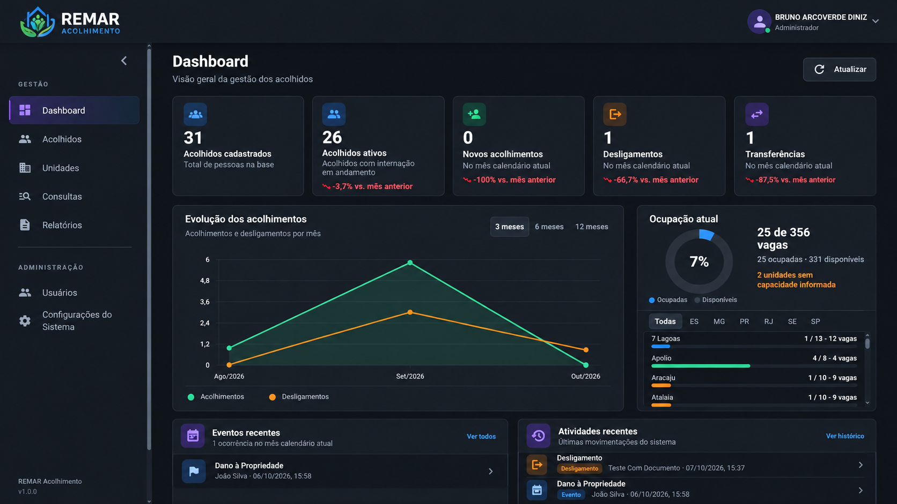

### Dashboard — Visão Alternativa

Representação adicional dos indicadores e gráficos do sistema.

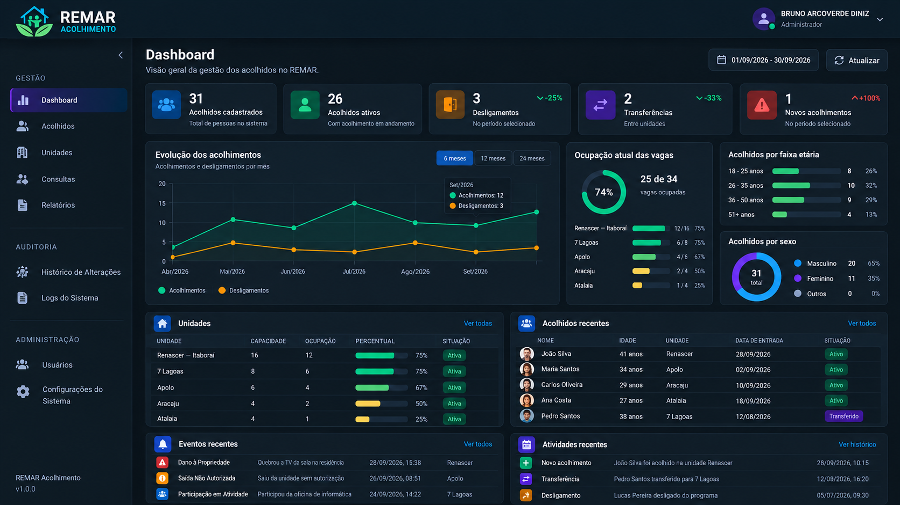

### Gestão de Acolhidos

Interface para consulta e gerenciamento dos registros de pessoas acolhidas.

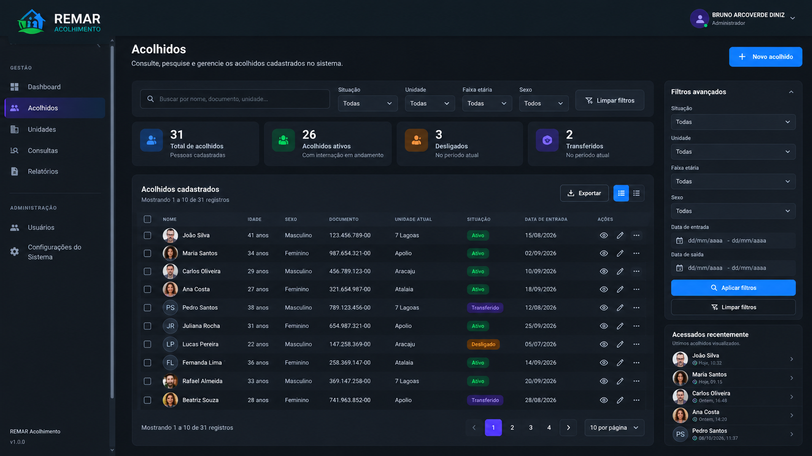

### Detalhes do Acolhido

Ficha individual com informações cadastrais e acesso aos módulos relacionados.

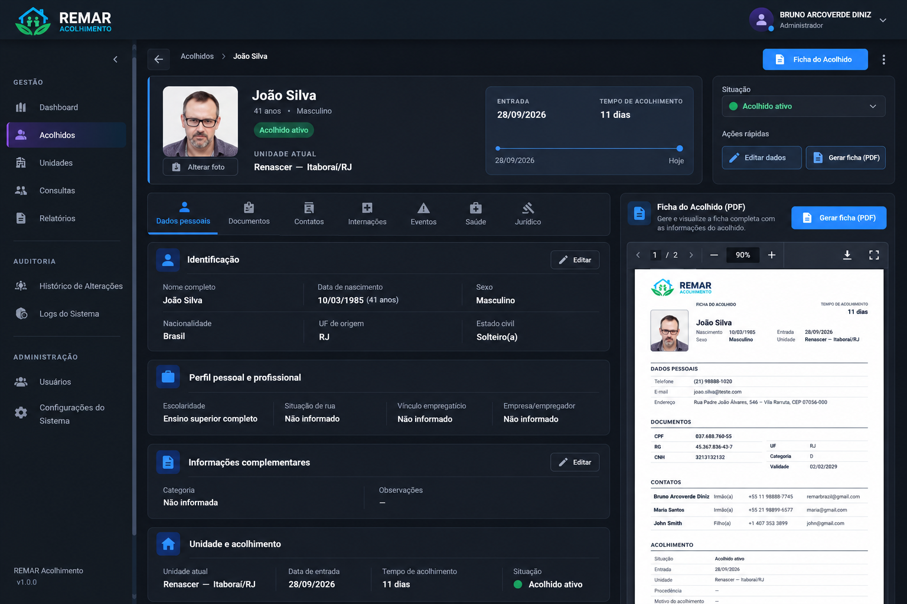

### Documentos

Consulta e organização de informações documentais dos acolhidos.

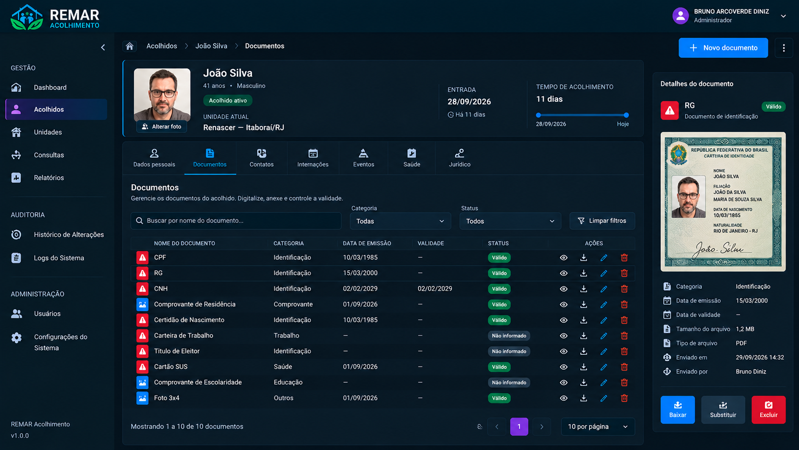

### Contatos

Cadastro e acompanhamento dos contatos de referência.

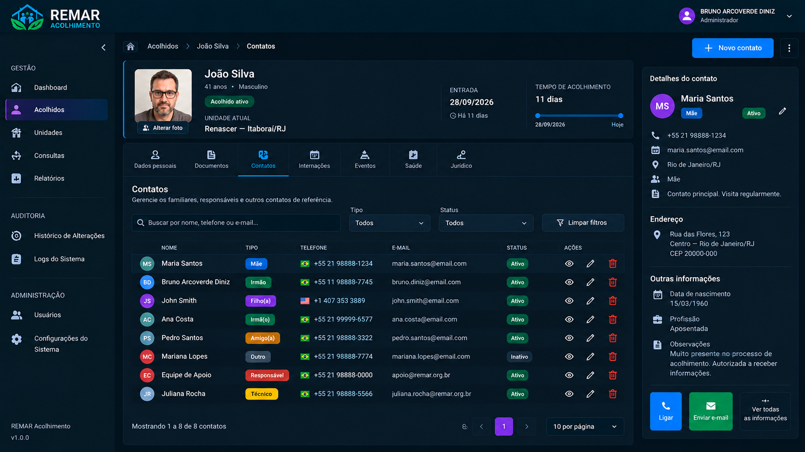

### Internações e Transferências

Histórico de acolhimentos, internações e transferências entre unidades.

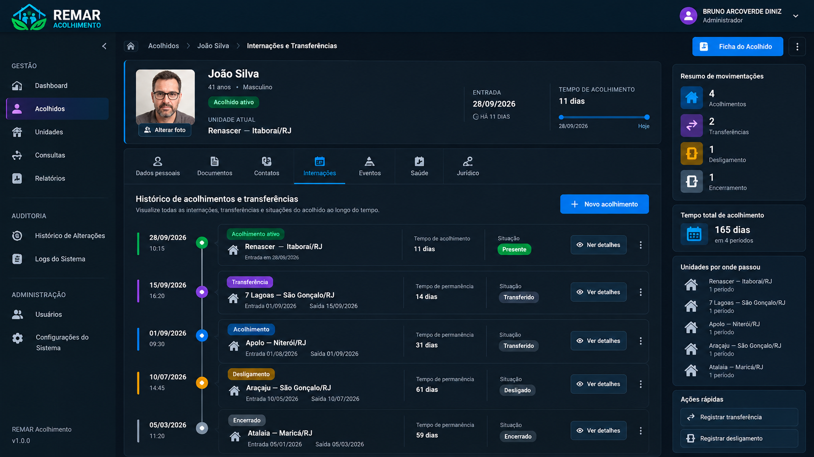

### Eventos e Ocorrências

Registro e acompanhamento de eventos e ocorrências relacionados aos acolhidos.

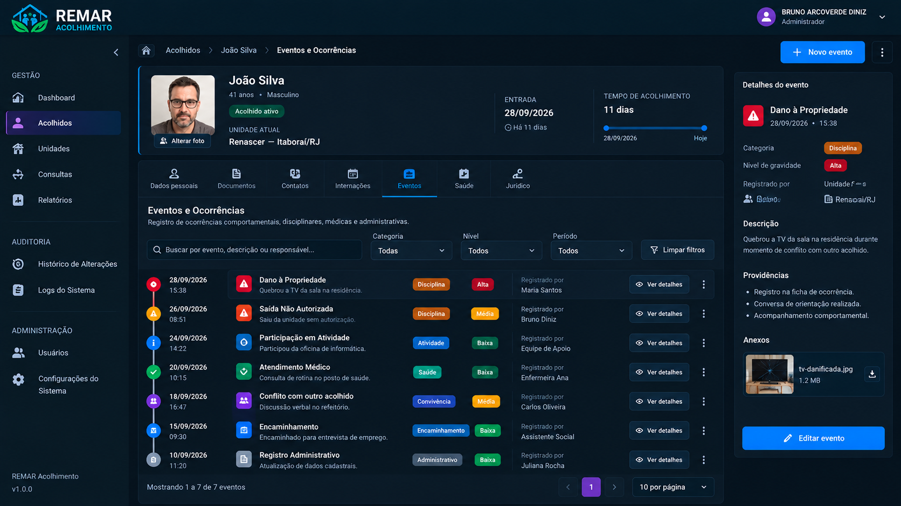

### Saúde do Acolhido

Informações de saúde, atendimentos e histórico de acompanhamento.

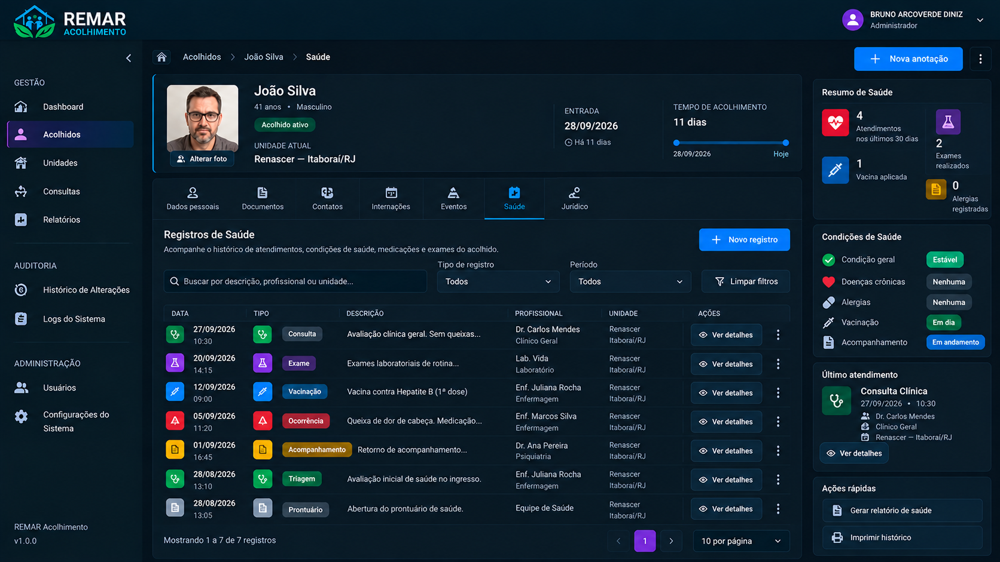

### Jurídico do Acolhido

Registros jurídicos, orientações, processos e acompanhamentos.

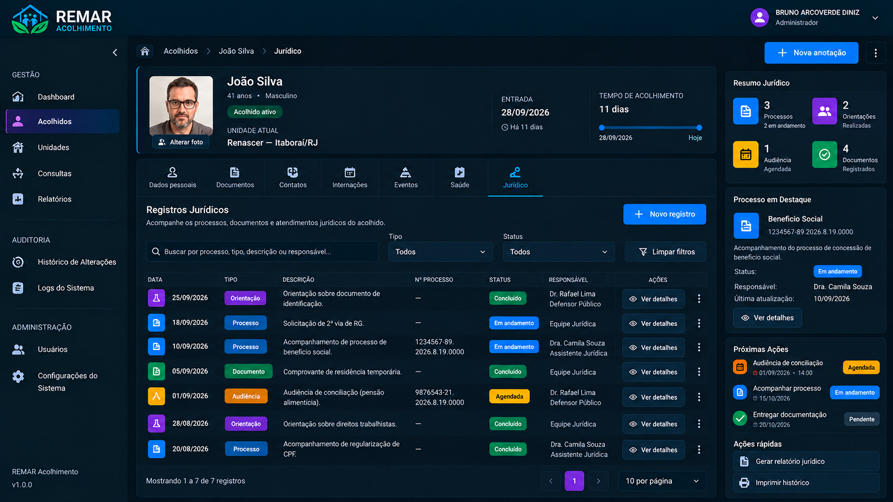

### Gestão de Unidades

Administração das unidades de acolhimento e suas informações operacionais.

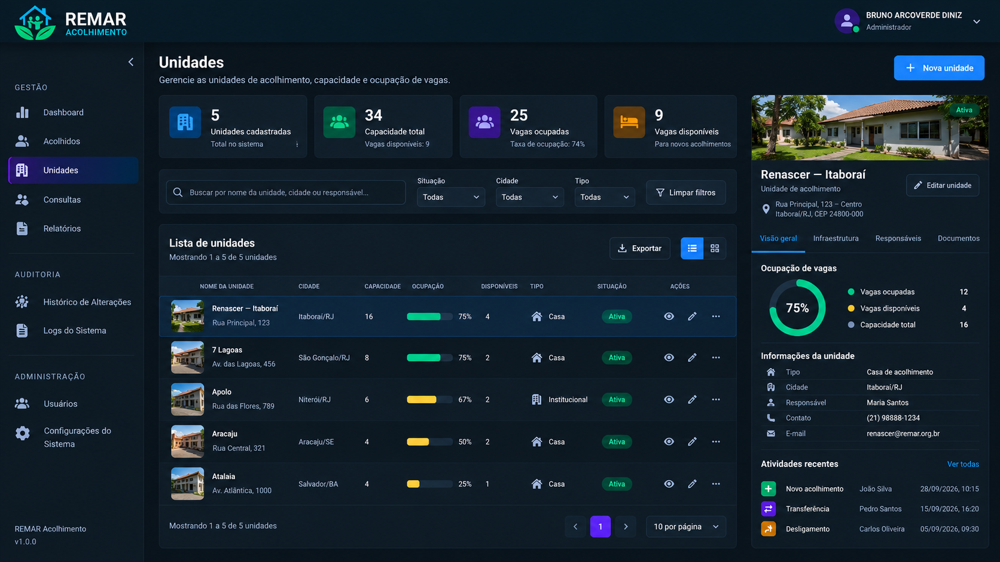

### Usuários e Permissões

Administração de usuários e visualização dos níveis de acesso por perfil (RBAC).

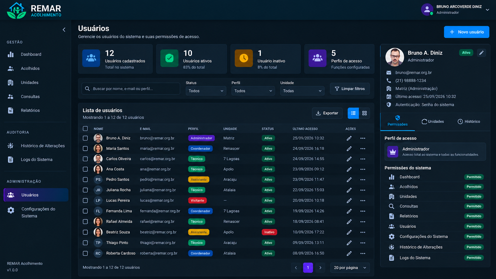

### Configurações do Sistema

Configurações estruturais e consulta de perfis e permissões.

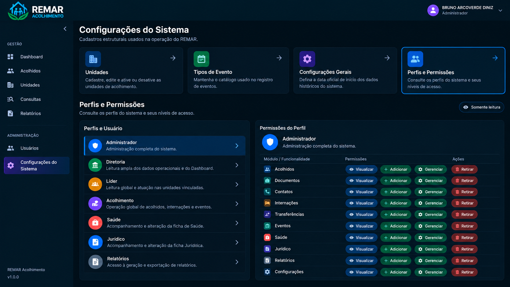

### Histórico de Alterações — Funcionalidade Planejada

Representação conceitual de uma página dedicada à auditoria e ao histórico de alterações do sistema. Esta interface específica está planejada e não deve ser interpretada como uma funcionalidade já implementada.

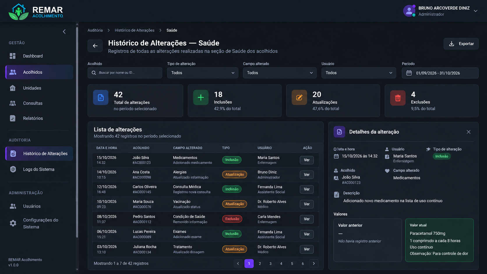

### Gerador de Ficha PDF

Interface de configuração e pré-visualização da ficha do acolhido em PDF.

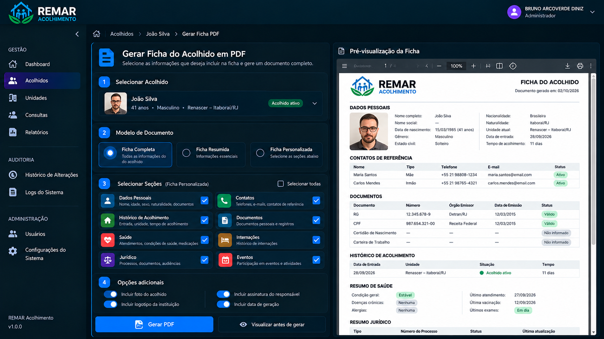

## Privacidade e Código-Fonte

O REMAR Acolhimento é desenvolvido para a Associação Remar do Brasil.

O código-fonte da aplicação, as configurações de produção e os dados institucionais não estão incluídos neste repositório público. Todas as demonstrações e capturas de tela futuras deverão utilizar informações fictícias ou devidamente anonimizadas.

## Desenvolvedor

**Bruno Arcoverde Diniz**  
Engenheiro de Software | Full-Stack e Sistemas Corporativos

Experiência em ambientes corporativos de TI, engenharia backend, bancos de dados relacionais, sistemas operacionais de negócio e desenvolvimento moderno de aplicações full-stack.

[Perfil no GitHub](https://github.com/brunoarcoverde)
