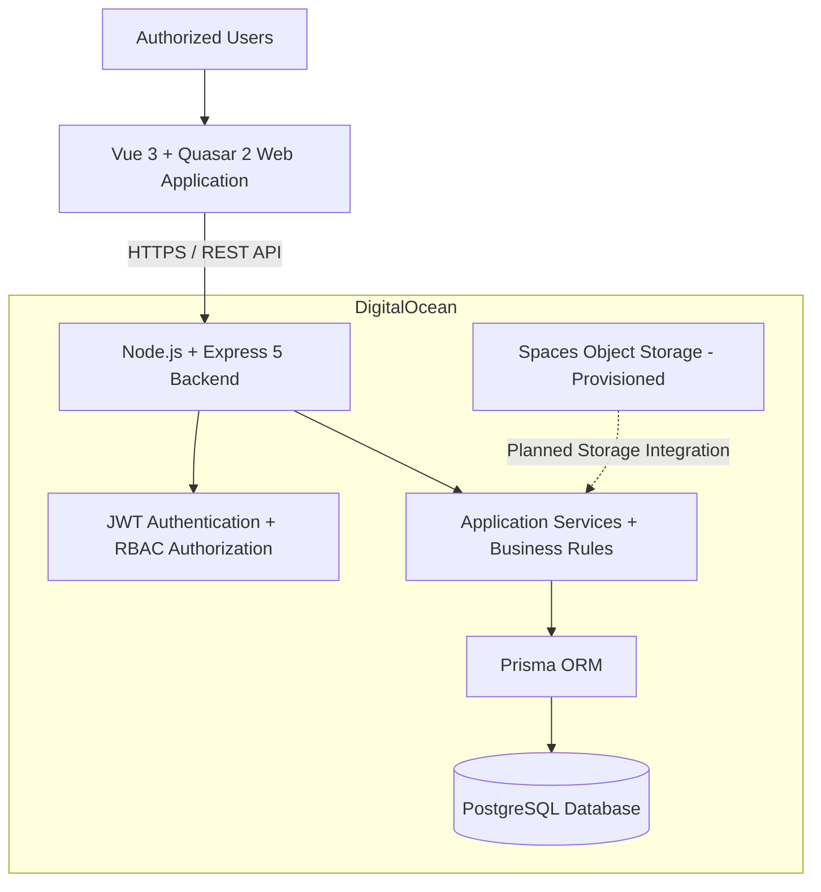

# REMAR Acolhimento — System Architecture

[← Back to Project Overview](../../README.md) | [🇧🇷 Português](../pt-BR/arquitetura.md)

## 1. Architecture Overview

REMAR Acolhimento is a full-stack social care management platform built around a modular client-server architecture.

The system combines a Vue-based web application, a REST API, a relational database, and DigitalOcean cloud infrastructure.

The architecture supports institutional workflows, access control, operational data management, and ongoing product evolution.

## 2. High-Level Architecture

The diagram distinguishes the application architecture from provisioned infrastructure. DigitalOcean Spaces is included as a planned storage integration, not as an implemented application dependency.

## 3. Frontend Architecture

**Technology stack:** Vue 3, Quasar 2, JavaScript, Vite, Vue Router.

The frontend is implemented as a single-page application (SPA).

Key architectural characteristics include:

- Component-based user interface
- Client-side navigation
- Centralized API request utility
- Authenticated application workflows
- Role-aware navigation and user interactions
- Operational dashboards and data management screens

The frontend communicates with the backend through HTTP requests to REST endpoints.

## 4. Backend Architecture

**Technology stack:** Node.js, Express 5, JavaScript, Prisma ORM.

The backend follows a modular architecture organized around:

1. **Routes:** Define API endpoints and connect requests to application handlers.
2. **Controllers:** Process HTTP requests and responses.
3. **Services:** Implement reusable business rules and domain operations.
4. **Prisma ORM:** Provides database access and relational data operations.
5. **PostgreSQL:** Stores persistent application data.

Some business logic remains within controllers as the application continues to evolve. Further separation into services is an ongoing architectural improvement.

## 5. Database Architecture

The platform uses PostgreSQL as its relational database.

The database supports interconnected institutional entities, including:

- People receiving care
- Admissions and care history
- Organizational units
- Transfers
- Documents and contacts
- Health-related records
- Events and operational activities
- Users, roles, and permissions

Prisma is used for schema definition, database access, and migrations.

### Database Migration

An important engineering milestone was the migration from SQLite to PostgreSQL.

This evolution aligned the persistence layer with the platform's cloud infrastructure and relational data requirements.

## 6. Authentication and Authorization

The platform implements JWT-based authentication and role-based access control (RBAC).

Core security mechanisms include:

- Password hashing with bcrypt
- Authentication middleware
- Permission validation on backend requests
- Role-based access restrictions
- Organizational unit-specific access rules
- Authenticated access to protected resources

Authorization is enforced at the backend rather than relying exclusively on frontend visibility controls.

## 7. Cloud Infrastructure

The platform's production infrastructure is provisioned on DigitalOcean.

| Component | Technology | Purpose |
|---|---|---|
| Application Hosting | DigitalOcean App Platform | Application deployment |
| Database | DigitalOcean Managed PostgreSQL 17 | Managed relational persistence |
| Object Storage | DigitalOcean Spaces | Provisioned storage for future integration |

The cloud environment is part of the platform's deployment and operational architecture.

This public case study intentionally excludes production credentials, private network details, and sensitive configuration.

## 8. Application Modules

The platform's implemented modules cover the following areas:

| Module | Responsibility |
|---|---|
| People Receiving Care | Institutional records and personal information management |
| Admissions | Admission workflows and care history |
| Transfers | Movement between organizational units |
| Documents | Document-related records |
| Contacts | Associated contact information |
| Organizational Units | Unit administration and capacity |
| Health Records | Health-related information and change history |
| Events | Institutional activities and events |
| Users and Access Control | User management, roles, and permissions |
| Dashboard | Operational indicators and management visibility |

## 9. Testing and Quality

The backend includes automated tests built with the native Node.js test runner.

Testing supports verification of application behavior, backend functionality, and business rules.

The engineering workflow includes implementation review, integration checks, and iterative validation. The existence of tests does not imply that every test has been executed successfully against every development revision.

## 10. Mobile Architecture Roadmap

The current implemented frontend is a web SPA.

Android and iOS delivery form part of the product's multiplatform roadmap. Quasar provides a potential foundation for mobile packaging, subject to implementation and validation.

Mobile-specific architecture and distribution details will be documented when developed.

## 11. Architectural Evolution — MVP 2

The architecture is intended to support continued product evolution, including:

- Additional operational workflows
- Reporting and management insights
- Auditing capabilities
- Privacy and data governance improvements
- Refinement of existing business modules
- Expansion of platform delivery options

These areas represent architectural evolution goals unless documented separately as implemented.

## 12. Engineering Ownership and AI-Assisted Development

The platform is developed by a sole human full-stack software engineer, with AI-assisted development tools integrated into the workflow.

Cursor and ChatGPT support activities such as implementation, code analysis, debugging, documentation, and technical exploration.

Engineering responsibility remains with the developer, including architecture decisions, code review, integration, testing, and validation.

## 13. Confidentiality

This repository documents the architecture at a professional case-study level.

Proprietary source code, production secrets, real institutional records, and sensitive personal information are intentionally excluded.

---

**Developer:** Bruno Arcoverde Diniz  
**Project:** REMAR Acolhimento  
**Organization:** Associação Remar do Brasil
