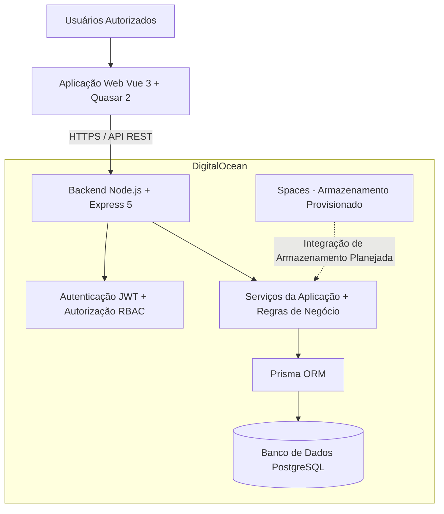

# REMAR Acolhimento — Arquitetura do Sistema

[← Voltar à Visão Geral](../../README.pt-BR.md) | [🇺🇸 English](../en/architecture.md)

## 1. Visão Geral da Arquitetura

O REMAR Acolhimento é uma plataforma full-stack de gestão de acolhimento social, construída com uma arquitetura modular cliente-servidor.

O sistema combina uma aplicação web baseada em Vue, uma API REST, um banco de dados relacional e infraestrutura em nuvem na DigitalOcean.

A arquitetura oferece suporte aos processos institucionais, controle de acesso, gestão de informações operacionais e evolução contínua do produto.

## 2. Diagrama Geral da Arquitetura

O diagrama diferencia a arquitetura implementada da infraestrutura provisionada. O DigitalOcean Spaces está representado como uma integração planejada, e não como uma dependência já implementada na aplicação.

## 3. Arquitetura Frontend

**Tecnologias:** Vue 3, Quasar 2, JavaScript, Vite e Vue Router.

O frontend é implementado como uma aplicação de página única (SPA).

Suas principais características arquiteturais incluem:

- Interface baseada em componentes
- Navegação no lado do cliente
- Utilitário centralizado de requisições à API
- Fluxos de trabalho autenticados
- Navegação e interações orientadas por funções e permissões
- Dashboards operacionais e telas de gestão de dados

O frontend se comunica com o backend por meio de requisições HTTP aos endpoints REST.

## 4. Arquitetura Backend

**Tecnologias:** Node.js, Express 5, JavaScript e Prisma ORM.

O backend utiliza uma arquitetura modular organizada em:

1. **Rotas:** Definem os endpoints da API e direcionam as requisições.
2. **Controladores:** Processam requisições e respostas HTTP.
3. **Serviços:** Implementam regras de negócio reutilizáveis e operações de domínio.
4. **Prisma ORM:** Realiza o acesso ao banco de dados e as operações relacionais.
5. **PostgreSQL:** Armazena os dados persistentes da aplicação.

Parte da lógica de negócio ainda permanece nos controladores enquanto a aplicação evolui. A separação adicional em serviços faz parte das melhorias arquiteturais contínuas.

## 5. Arquitetura do Banco de Dados

A plataforma utiliza PostgreSQL como banco de dados relacional.

O banco de dados oferece suporte a entidades institucionais interconectadas, incluindo:

- Pessoas acolhidas
- Internações e histórico de acolhimento
- Unidades organizacionais
- Transferências
- Documentos e contatos
- Registros relacionados à saúde
- Eventos e atividades operacionais
- Usuários, funções e permissões

O Prisma é utilizado para definição do esquema, acesso ao banco de dados e migrações.

### Migração do Banco de Dados

Um marco importante de engenharia foi a migração de SQLite para PostgreSQL.

Essa evolução alinhou a camada de persistência à infraestrutura em nuvem e às necessidades do modelo relacional da plataforma.

## 6. Autenticação e Autorização

A plataforma implementa autenticação baseada em JWT e controle de acesso baseado em funções (RBAC).

Os principais mecanismos de segurança incluem:

- Hash de senhas com bcrypt
- Middleware de autenticação
- Validação de permissões nas requisições ao backend
- Restrições de acesso baseadas em funções
- Regras de acesso específicas por unidade organizacional
- Acesso autenticado a recursos protegidos

A autorização é aplicada no backend, sem depender exclusivamente dos controles de visibilidade do frontend.

## 7. Infraestrutura em Nuvem

A infraestrutura de produção da plataforma está provisionada na DigitalOcean.

| Componente | Tecnologia | Finalidade |
|---|---|---|
| Hospedagem da Aplicação | DigitalOcean App Platform | Implantação da aplicação |
| Banco de Dados | DigitalOcean Managed PostgreSQL 17 | Persistência relacional gerenciada |
| Armazenamento de Objetos | DigitalOcean Spaces | Armazenamento provisionado para integração futura |

O ambiente em nuvem faz parte da arquitetura de implantação e operação da plataforma.

Este estudo de caso público não inclui credenciais de produção, detalhes de rede privada ou configurações sensíveis.

## 8. Módulos da Aplicação

Os módulos implementados abrangem as seguintes áreas:

| Módulo | Responsabilidade |
|---|---|
| Pessoas Acolhidas | Gestão de registros institucionais e informações pessoais |
| Internações | Fluxos de internação e histórico de acolhimento |
| Transferências | Movimentação entre unidades organizacionais |
| Documentos | Registros relacionados a documentos |
| Contatos | Informações de contatos associados |
| Unidades Organizacionais | Administração de unidades e capacidade |
| Registros de Saúde | Informações relacionadas à saúde e histórico de alterações |
| Eventos | Atividades e eventos institucionais |
| Usuários e Controle de Acesso | Gestão de usuários, funções e permissões |
| Dashboard | Indicadores operacionais e informações gerenciais |

## 9. Testes e Qualidade

O backend possui testes automatizados desenvolvidos com o executor nativo de testes do Node.js.

Os testes auxiliam na verificação do comportamento da aplicação, das funcionalidades do backend e das regras de negócio.

O processo de engenharia inclui revisão de implementações, verificações de integração e validação iterativa. A existência de testes não significa que todos tenham sido executados com sucesso em cada revisão do código.

## 10. Planejamento da Arquitetura Mobile

O frontend atualmente implementado é uma aplicação web SPA.

O desenvolvimento para Android e iOS faz parte do planejamento multiplataforma do produto. O Quasar oferece uma possível base para empacotamento mobile, dependendo de implementação e validação.

Os detalhes da arquitetura mobile e da distribuição serão documentados conforme forem desenvolvidos.

## 11. Evolução Arquitetural — MVP 2

A arquitetura foi concebida para permitir a evolução contínua do produto, incluindo:

- Novos fluxos operacionais
- Relatórios e indicadores gerenciais
- Funcionalidades de auditoria
- Melhorias de privacidade e governança de dados
- Aperfeiçoamento dos módulos de negócio existentes
- Expansão das opções de disponibilização da plataforma

Essas áreas representam objetivos de evolução arquitetural, exceto quando documentadas separadamente como implementadas.

## 12. Responsabilidade Técnica e Desenvolvimento Assistido por IA

A plataforma é desenvolvida por um único engenheiro de software full-stack humano, com ferramentas de inteligência artificial integradas ao processo de desenvolvimento.

Cursor e ChatGPT auxiliam em atividades como implementação, análise de código, depuração, documentação e exploração técnica.

A responsabilidade pela engenharia permanece com o desenvolvedor, incluindo decisões arquiteturais, revisão de código, integração, testes e validação.

## 13. Confidencialidade

Este repositório documenta a arquitetura em nível de estudo de caso profissional.

Código-fonte proprietário, segredos de produção, registros institucionais reais e informações pessoais sensíveis não são divulgados.

---

**Desenvolvedor:** Bruno Arcoverde Diniz  
**Projeto:** REMAR Acolhimento  
**Organização:** Associação Remar do Brasil
